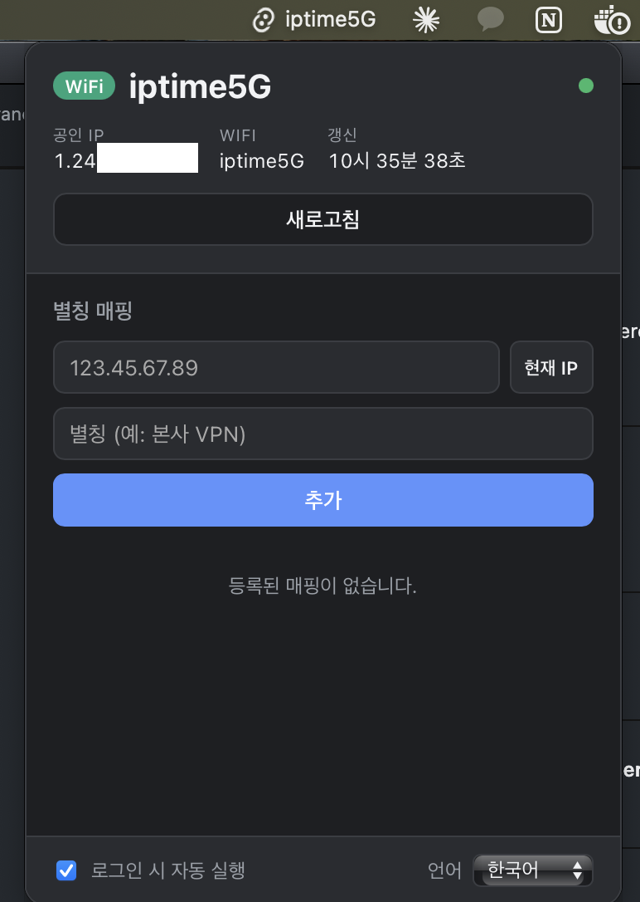

# IP Tag

[한국어](README.md) · **English** · [日本語](README.ja.md)

> Know **where** your public IP is — right from the menu bar.

A tiny macOS menu bar app that lives in your tray, periodically checks your current
public IP and Wi-Fi, and shows a human-friendly **alias** so you instantly know
"where am I connected from right now."

<p align="center">
  
</p>

---

## Why I built this

When you hop between networks (home, office, VPN) all day, it's easy to lose track
of which one you're actually on. And a raw IP like `123.45.67.89` tells you nothing
at a glance.

So you map your frequently-used IPs to aliases like **`Office VPN`, `Home`, `Cafe`**
ahead of time, and a quick look at the menu bar tells you exactly where you are.

- Confirm your IP is whitelisted before hitting a firewall-restricted service
- Verify your VPN actually connected
- The label updates automatically when the network changes

---

## Features

- **IP → alias mapping** — give each IP a name, with full CRUD (add/edit/delete)
- **Automatic polling** — refreshes public IP + Wi-Fi SSID in the background every 45s
- **Smart label** — display priority: `alias > Wi-Fi name > public IP`
- **Lives in the menu bar** — an Accessory app (no Dock icon); click the tray to pop over
- **Offline-tolerant** — survives failed IP lookups, just shows the state and recovers automatically
- **Multilingual** — 한국어 / English / 日本語, switchable in settings (tray menu included)
- **Launch at login** toggle
- **Dark mode** support

---

## How it works

| Item | Method |
|------|--------|
| Public IP | Queries `api.ipify.org`, falls back to `icanhazip.com` on failure |
| Wi-Fi SSID | `ipconfig getsummary <iface>` — exposes SSID without location permission |
| Mapping storage | `tauri-plugin-store` (local JSON) |
| Update notice | The poller emits a `net-status` event to the frontend on every check |

The React frontend only subscribes to events — all lookups, storage, and label
decisions happen in the Rust backend.

---

## Tech stack

- **[Tauri v2](https://tauri.app/)** (Rust) — tray / polling / networking / storage
- **React + TypeScript + Vite** — the popover UI
- Plugins: `store`, `autostart`, `opener`

---

## Prerequisites

- **Node.js** (18+)
- **Xcode Command Line Tools** — `xcode-select --install`
- **Rust toolchain** — if not installed:

  ```bash
  curl --proto '=https' --tlsv1.2 -sSf https://sh.rustup.rs | sh
  ```

> **Note for zsh users:** rustup writes its PATH setup to `~/.profile`, which zsh does not read.
> If `cargo --version` fails in a new terminal, add this line to `~/.zshrc`:
>
> ```bash
> echo '. "$HOME/.cargo/env"' >> ~/.zshrc && source ~/.zshrc
> ```
>
> (Skipping this causes `cargo metadata ... No such file or directory` when running `npm run tauri dev`.)

## Development

```bash
# install dependencies
npm install

# dev mode (hot reload)
npm run tauri dev

# release build (.app / .dmg)
npm run tauri build
```

---

## Project structure

```
src/                  # React popover UI
  App.tsx             # IP card + mapping CRUD screen
  api.ts              # invoke / event bindings
  i18n.tsx            # i18n dictionary + language context (ko/en/ja)

src-tauri/src/
  poller.rs           # 45s polling loop + label decision + event emit
  net.rs              # public IP / Wi-Fi SSID lookups
  mappings.rs         # IP-alias mapping storage (store)
  tray.rs             # menu bar tray icon + popover
  state.rs            # shared state
  lib.rs              # command registration / app setup
```
